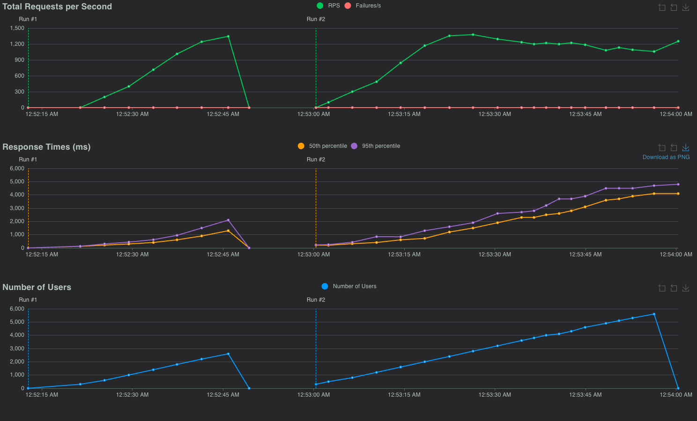
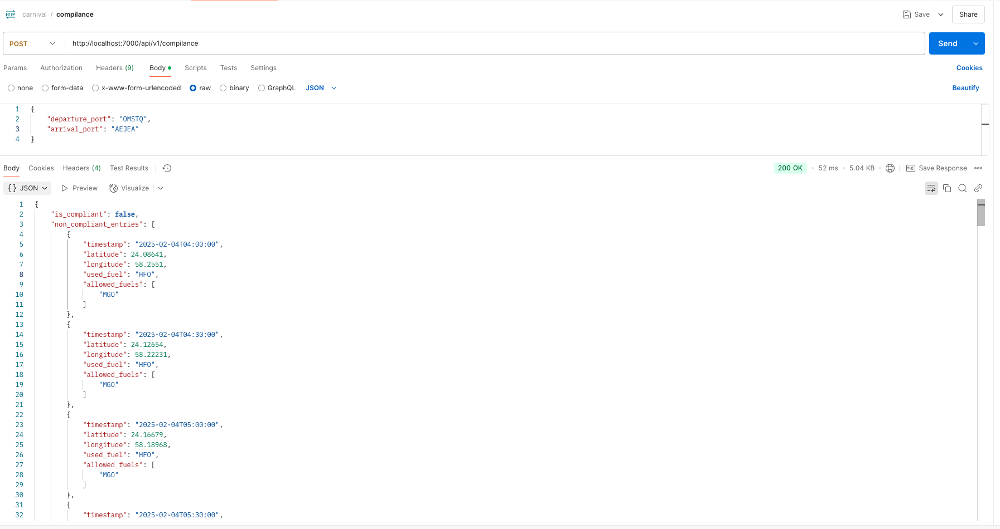

# Carnival Compliance Service

carnival compilance service that checks if an optimization result follows the fuel allowances for the route

## Load Testing



## Sample Resoponse



# Get Started

Note: the following venv creation is for unix os (mac/linux)

## setup

```bash
git clone https://github.com/AbdelrahmanAbounida/carnival-task
cd carnival-task
```

```
make run RUNNER=python # for pip setup
```

OR

```
make run RUNNER=pdm
```

OR

```
make run RUNNER=docker
```

## 1. PDM Build

<br />

**installation**

```
pip install pdm
python -m venv venv
source venv/bin/activate
pdm install
```

<br />

**Run the app**

```
pdm run main.py
```

<br />

**linting and formatting**

```
pdm run pre-commit
```

<br />

**testing**

```
pdm run pytest
```

## 2. Docker

```
docker build -t carnival .
docker run -it -p 7000:7000 carnival
```

## 3. Pip

```
python -m venv venv
source venv/bin/activate
pip install -r requirements.txt
python main.py
```

# How To call the api

```python
import requests

url = "http://localhost:7000/api/v1/compilance?departure_port=OMSTQ&arrival_port=AEJEA"

headers = {
  'Accept-Encoding': 'gzip',
  'server-api-key': 'abc'
}

response = requests.request("GET", url, headers=headers)
print(response.json())
```

# TODO

- [x] Basic Project Setup
- [x] PDM init
- [x] precommit
- [x] linting >> black, ruff, isort
- [x] sample route
- [x] Dockerizing app
- [x] logging
- [x] init TDD
- [x] pytest
- [x] CICD
- [x] Basic Functionality
- [x] Update Task
- [x] auto build and deploy on each pull / push to main
- [x] setup in README
- [x] authenticate routes
- [x] Makefile
- [x] load testing
- [ ] final tesing of CICD
